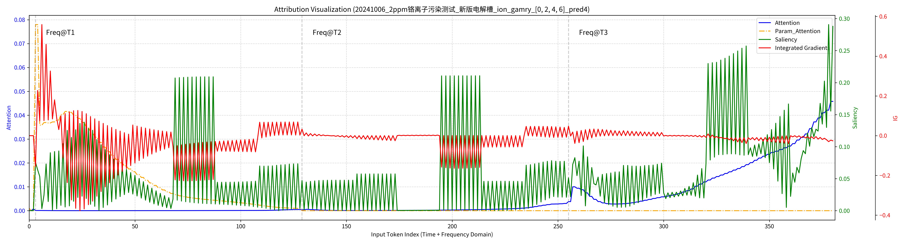

[English](./README.md) | [简体中文](./README.zh-CN.md)  
[](https://kudouzala.github.io/ion_detect_page/)
[](https://huggingface.co/datasets/KudouZala/PEM_electrolyzer-ion_detect)

## Quick Start (Paper model: `SWC-PSWM`)

If you want to reproduce the paper model first, run these commands:

```bash
conda create -n ion_detect python=3.10
conda activate ion_detect
pip install -r requirements.txt
python scripts/machine_learning_code/main.py --config scripts/machine_learning_code/configs/paper/SWC-PSWM.yaml --train
```

For paper ablations, use:

- `scripts/machine_learning_code/configs/paper/exp_a.yaml`
- `scripts/machine_learning_code/configs/paper/exp_b.yaml`
- `scripts/machine_learning_code/configs/paper/exp_c.yaml`
- `scripts/machine_learning_code/configs/paper/exp_d.yaml`

# File Description

- The `data` folder contains the raw voltage and impedance measurement data. `firecloud` and `gamry` are the impedance measurement devices. Each experiment's `details.txt` describes materials and procedures. If an `edx` folder exists, it contains EDX data for that experiment.
- The `datasets` folder contains datasets for machine learning training.
- The `logs` folder stores runtime log files.
- The `output` folder contains trained models and inference outputs, including `Attn_heatmap`, `IG`, `Saliency`, and ML analysis results.
- The `scripts` folder stores all source code.

The experimental dataset is available on Hugging Face:
https://huggingface.co/datasets/KudouZala/PEM_electrolyzer-ion_detect


# Usage Instructions

This repository is designed to accompany the research paper and allows full reproduction of the workflow.
If you wish to use your own `data` for AutoEIS fitting and training, please organize your files following the same format under the `data` folder. Then, convert the raw data into training-ready format in the `datasets` folder as described below, and start training.
It is recommended to first reproduce the entire process to fully understand how the code works.

Internal exploratory experiments are archived under:
`scripts/machine_learning_code/configs/internal/`.

---

## Installation and Configuration

If you need to perform EIS fitting, you must install `autoeis` and `julia`.  
The AutoEIS source repository: https://github.com/AUTODIAL/AutoEIS  
Thanks to the author for open-sourcing their code.  
If you cloned this repo directly, it already includes `autoeis`.  
If you do not need EIS fitting and only plan to perform machine learning training, you can skip the installation of `autoeis` and `julia`.  
We recommend running everything on **Ubuntu 22.04**, otherwise certain parts (especially EIS fitting and training scripts) may report errors.

### Environment Setup

1. Create and activate a Conda environment:

   ```bash
   conda create -n ion_detect python=3.10
   conda activate ion_detect
   ```

2. Install PyTorch that matches your CUDA version. (CUDA 12.1 tested and confirmed working.)

   ```bash
   conda install pytorch==2.5.1 torchvision==0.20.1 torchaudio==2.5.1 pytorch-cuda=12.1 -c pytorch -c nvidia
   ```

3. Clone this project and install dependencies:

   ```bash
   git clone https://github.com/KudouZala/ion_detect.git
   cd ion_detect
   pip install -r requirements.txt
   ```

---

### Install Julia and AutoEIS

1. Download Julia from https://julialang.org/downloads/ (use the LTS version) and extract it to `/opt` (or another directory):

   ```bash
   tar -xvzf julia-1.10.10-linux-x86_64.tar.gz
   sudo mv julia-1.10.10 /opt/
   ```

2. Create a symbolic link to make `julia` command available:

   ```bash
   sudo ln -s /opt/julia-1.10.10/bin/julia /usr/local/bin/julia
   echo 'export PATH="/opt/julia-1.10.10/bin:$PATH"' >> ~/.bashrc
   source ~/.bashrc
   ```

3. Verify Julia installation:

   ```bash
   julia --version
   ```

4. Install `autoeis`:

   ```bash
   cd autoeis/
   conda activate ion_detect
   pip install -e .
   ```

---

## Using Raw Data

The `data` folder contains the raw voltage and impedance measurements.  
Download link: https://huggingface.co/datasets/KudouZala/PEM_electrolyzer-ion_detect  
After downloading, extract to the `data` folder following the structure `/ion_detect/data/校内测试/xxx测试`.  
The data includes both `firecloud` and `gamry` measurement devices.  
The `scripts` folder under `data` contains tools for impedance fitting, voltage analysis, and impedance plotting.

### View Relative Voltage Variation Over Time

Use `ion_detect/data/scripts/eis_code/v_t_plot_code/v_t_relative_compare_xx.py` as a template, fill in `group_folders_firecloud` and `group_folders_gamry`, then run:

```bash
python data/scripts/eis_code/v_t_plot_code/v_t_relative_compare_plot.py
```


Compare voltages before and after H2SO4 recovery:

```bash
python data/scripts/eis_code/v_t_plot_code/v_t_relative_compare_all_renew.py
```

The output images are saved in `ion_detect/data/volt_t_plot`.

---

### View Nyquist Impedance Variation Over Time

Use `ion_detect/data/scripts/eis_code/v_t_plot_code/nyquist_plot_zhiyun_and_gamry_xx.py` as a template, fill in the required folder paths, then run:

```bash
python data/scripts/eis_code/nyquist_plot_code/nyquist_plot_zhiyun_and_gamry_plot.py
```


Similarly, for Bode plots:
```bash
python data/scripts/eis_code/nyquist_plot_code/bode_plot_zhiyun_and_gamry_plot.py
```
  


---

### Impedance Fitting

```bash
python data/scripts/all_impedance_fit.py > ../logs/$(date +%Y%m%d).log 2>&1
```
You can customize the equivalent circuit and the data to fit in `all_impedance_fit.py`.  
Logs are saved to `ion_detect/data/logs`, and fitting results to `/ion_detect/data/eis_fit_results/<date>/`.


### Using Your Own Test Data for Impedance Fitting

If you wish to use your own test data, add it under the `校内测试` folder following the same structure.  
Copy the `code` folder (and its scripts) from an existing folder such as `data/校内测试/20250103_无离子污染测试/code` into your new folder.  
Run `python run_data_exchange_code_gamry_single.py` or `python run_data_exchange_code_firecloud_single.py` for your data format, then generate `output_txt`, `output_csv`, and `output_xlsx` folders with transferred data.  
Finally, add your folder path into the main program of `all_impedance_fit.py` for fitting.  
The fitting results will be saved in `ion_detect/data/eis_fit_results/<date>/`.

---

### Export Impedance Analysis Results

To sort fitted results in the order `RO, R1, R2, R3` (Ohmic -> Low-frequency -> Mid-frequency -> High-frequency):

```bash
python data/scripts/excel_code/excel_PnPw_sequence_all.py  # Modify folder_path = "20250724" to match your eis_fit_results folder name
```
Each subfolder will contain `_sorted.xlsx` and `_sorted.png` files.  


---

### Impedance Fitting Result Analysis

Compare variations of equivalent circuit parameters for each ion type:

```bash
python data/scripts/fit_res_analysis.py  # Modify date_folder = "20250723" to match your eis_fit_results folder name
```
Results will appear under `/ion_detect/data/eis_fit_analysis_results`, e.g. `_20250723.xlsx` and `_20250723.png`, showing parameter changes from 0-6h for each ion type.

  


---

### Impedance Fitting Result Analysis - H2SO4 Recovery Comparison

```bash
python data/scripts/fit_res_analysis2.py  # Modify date_folder = "20250723" to match your eis_fit_results folder name
```
Results appear in `/ion_detect/data/eis_fit_analysis_results`, e.g. `_20250723.xlsx` and `_20250723.png`, showing parameter variations before, during, and after H2SO4 recovery.

  


---

### Machine Learning Training
If you want to use your own data to convert into training data, please read steps one and two; if you simply want to reproduce the paper, please skip to step three.
1. Organize the `gamry` or `firecloud` data in the same folder format in `ion_detect/data/校内测试/...`, then add your folder paths into `label_machine_learning_excel_export_gamry_range.py` or `label_machine_learning_excel_export_firecloud_range.py`.

2. Run the following commands to generate formatted Excel files:

   ```bash
   python data/scripts/excel_code/label_machine_learning_excel_export_gamry_range.py
   python data/scripts/excel_code/label_machine_learning_excel_export_firecloud_range.py
   ```

   The generated Excel files will appear under `/ion_detect/data/校内测试/数据整理_range`.  
   Select your desired training data and place it into the `ion_detect/datasets/...` folder for training.

3. Paper model training/testing commands:

   ```bash
   mkdir -p logs
   # Paper main model (SWC-PSWM)
   python scripts/machine_learning_code/main.py --config scripts/machine_learning_code/configs/paper/SWC-PSWM.yaml --train > ./logs/SWC-PSWM.log 2>&1
   python scripts/machine_learning_code/main.py --config scripts/machine_learning_code/configs/paper/SWC-PSWM.yaml --search > ./logs/SWC-PSWM_search.log 2>&1
   python scripts/machine_learning_code/main.py --config scripts/machine_learning_code/configs/paper/SWC-PSWM.yaml --test > ./logs/SWC-PSWM_test.log 2>&1
   ```

   **Important (`--search` -> `--test`):**
   - `--test` always loads:
     `output/trained_model_save/SWC-PSWM/trained_model_epoch_best.pth`
   - `--search` evaluates all `trained_model_epoch_*.pth` and writes CSV reports, but does **not** automatically replace `trained_model_epoch_best.pth`.
   - If `trained_model_epoch_best.pth` is missing, `--test` will automatically pick the best checkpoint from `search_checkpoints_accuracy_sorted.csv` (or fallback to highest epoch) and copy it to `trained_model_epoch_best.pth`.
   - Before running `--test` for paper plots, copy the best checkpoint (highest accuracy) to `trained_model_epoch_best.pth`.

   Example (auto-pick best epoch from `search_checkpoints_accuracy_sorted.csv`):
   ```bash
   python - <<'PY'
   import csv, shutil
   from pathlib import Path

   run_dir = Path("output/trained_model_save/SWC-PSWM")
   csv_path = run_dir / "search_checkpoints_accuracy_sorted.csv"
   with csv_path.open("r", encoding="utf-8") as f:
       rows = list(csv.DictReader(f))
   best = rows[-1]["ckpt_file"]  # CSV is sorted by accuracy ascending
   src = run_dir / best
   dst = run_dir / "trained_model_epoch_best.pth"
   shutil.copy2(src, dst)
   print(f"Copied best checkpoint: {src} -> {dst}")
   PY
   ```

   Results are saved under `/ion_detect/output/trained_model_save/SWC-PSWM/` and `/ion_detect/output/inference_results/SWC-PSWM/`.
   

---

### AI-Assisted Ion Effect Analysis
To reproduce paper-style interpretation analysis, first run test with `SWC-PSWM`, then run analysis scripts in `scripts/ml_analysis_code/` with `--load_run=SWC-PSWM`.

For example, if you want to plot hidden-state parameters specifically for early-stage 2ppm data (`0-6h`), set `paths.test_folder` in your YAML config to:
`datasets/datasets_for_range_ion_0_6_2ppm`

Example:
```bash
python scripts/machine_learning_code/main.py --config scripts/machine_learning_code/configs/paper/SWC-PSWM.yaml --test
python scripts/ml_analysis_code/csv_plot.py --load_run=SWC-PSWM
python scripts/ml_analysis_code/csv_plot_param.py --load_run=SWC-PSWM
python scripts/ml_analysis_code/csv_plot_param2.py --load_run=SWC-PSWM
```

Script purposes:
- `csv_plot.py`: plots attribution-level results (`Attention`, `Param-Attention`, `Saliency`, `IG`) from per-sample CSV outputs.
- `csv_plot_param.py`: computes ion-wise averages of influence parameters (`psi`, `theta_ca`, `theta_an`, `phi_ca`, `phi_an`) and saves a summary CSV/plot.
- `csv_plot_param2.py`: performs time-series analysis of initial-state parameters (`sigma_mem`, `alpha_ca`, `alpha_an`, `i_0ca`, `i_0an`) at `0/2/4/6h`, and also outputs `6h-0h` delta statistics/figures.
- `csv_plot_param.py` and `csv_plot_param2.py` now auto-adapt to detected time windows in result filenames (no manual edit needed when `num_time_points` changes).

Recommendation:
- Keep these scripts separate for now (different targets and assumptions, easier to maintain and debug).
- If you only need attribution maps, run `csv_plot.py` only.
- For paper-style hidden-state parameter analysis, run both `csv_plot_param.py` and `csv_plot_param2.py`.




---

### AI-Assisted H2SO4 Recovery Analysis

```bash
python scripts/machine_learning_code/main.py --config scripts/machine_learning_code/configs/paper/SWC-PSWM.yaml --test
python scripts/ml_analysis_code/h2so4_analysis.py --load_run=SWC-PSWM
```
This visualizes 5 key factor changes across pre-contamination (0h), post-contamination (6h), and recovered states.  
Requires windows `[0,2,4,6]` (for baseline/recovery initial state) and `[6,8,10,12]` (for polluted initial state), following the fixed H2SO4 analysis definition.  
The plots can be compared with impedance fitting results for the same three time points.


# Acknowledgement
This project includes code adapted from AutoEIS
(https://github.com/AUTODIAL/AutoEIS),
licensed under the MIT License.

Copyright (c) AutoEIS contributors.