---

[English](./README.md) | [简体中文](./README.zh-CN.md)  

[](https://kudouzala.github.io/ion_detect_page/)
[](https://huggingface.co/datasets/KudouZala/PEM_electrolyzer-ion_detect)

# 文件描述

* `data` 文件夹包含原始电压和阻抗测量数据。`firecloud` 和 `gamry` 是阻抗测量设备。每个实验文件夹下的 `details.txt` 文件描述了实验中使用的材料和步骤。如果存在 `edx` 文件夹，则包含该实验的 EDX 测试数据。
* `datasets` 文件夹包含用于机器学习训练的数据集。
* `logs` 文件夹存储程序运行日志文件。
* `output` 文件夹包含训练好的模型和推理输出，包括 `Attn_heatmap`、`IG`、`Saliency` 以及机器学习分析结果。
* `scripts` 文件夹存储所有源代码。

# 使用说明

本仓库是为配套研究论文而设计的，支持对整个工作流进行完整复现。
如果你想使用自己的 `data` 进行 AutoEIS 拟合和训练，请按照 `data` 文件夹下的相同格式组织文件。然后，按照下文说明将原始数据转换为 `datasets` 文件夹中的训练就绪格式，并开始训练。
建议先完整复现一遍整个流程，以充分理解代码的运行逻辑。

---

## 安装与配置

如果你需要进行 EIS 拟合，必须安装 `autoeis` 和 `julia`。

AutoEIS 源码仓库: [https://github.com/AUTODIAL/AutoEIS](https://github.com/AUTODIAL/AutoEIS)

感谢作者开源其代码。

如果你直接克隆本仓库，其中已包含了 `autoeis`。

如果你不需要 EIS 拟合，只打算进行机器学习训练，可以跳过 `autoeis` 和 `julia` 的安装。

推荐在 **Ubuntu 22.04** 上运行，否则某些部分（尤其是 EIS 拟合和训练脚本）可能会报错。

### 环境设置

1. 创建并激活 Conda 环境：
```bash
conda create -n ion_detect python=3.10
conda activate ion_detect

```


2. 安装与你的 CUDA 版本匹配的 PyTorch。（已测试并确认 CUDA 12.1 可用。）
```bash
conda install pytorch==2.5.1 torchvision==0.20.1 torchaudio==2.5.1 pytorch-cuda=12.1 -c pytorch -c nvidia

```


3. 克隆本项目并安装依赖：
```bash
git clone https://github.com/KudouZala/ion_detect.git
cd ion_detect
pip install -r requirements.txt

```


---

### 安装 Julia 和 AutoEIS

1. 从 [https://julialang.org/downloads/](https://julialang.org/downloads/) 下载 Julia（使用 LTS 版本）并解压到 `/opt`（或其他目录）：
```bash
tar -xvzf julia-1.10.10-linux-x86_64.tar.gz
sudo mv julia-1.10.10 /opt/

```


2. 创建符号链接使 `julia` 命令可用：
```bash
sudo ln -s /opt/julia-1.10.10/bin/julia /usr/local/bin/julia
echo 'export PATH="/opt/julia-1.10.10/bin:$PATH"' >> ~/.bashrc
source ~/.bashrc

```


3. 验证 Julia 安装：
```bash
julia --version

```


4. 安装 `autoeis`：
```bash
cd autoeis/
conda activate ion_detect
pip install -e .

```


---

## 使用原始数据

`data` 文件夹包含原始电压和阻抗测量结果。

下载链接: [https://huggingface.co/datasets/KudouZala/PEM_electrolyzer-ion_detect](https://huggingface.co/datasets/KudouZala/PEM_electrolyzer-ion_detect)

下载后，按照结构 `/ion_detect/data/校内测试/xxx测试` 解压到 `data` 文件夹。

数据包含 `firecloud` 和 `gamry` 测量设备的结果。

`data` 文件夹下的 `scripts` 文件夹包含用于阻抗拟合、电压分析和阻抗绘图的工具。

### 查看电压随时间变化的相对变化

使用 `ion_detect/data/scripts/eis_code/v_t_plot_code/v_t_relative_compare_xx.py` 作为模板，填写 `group_folders_firecloud` 和 `group_folders_gamry`，然后运行：

```bash
python data/scripts/eis_code/v_t_plot_code/v_t_relative_compare_plot.py 

```
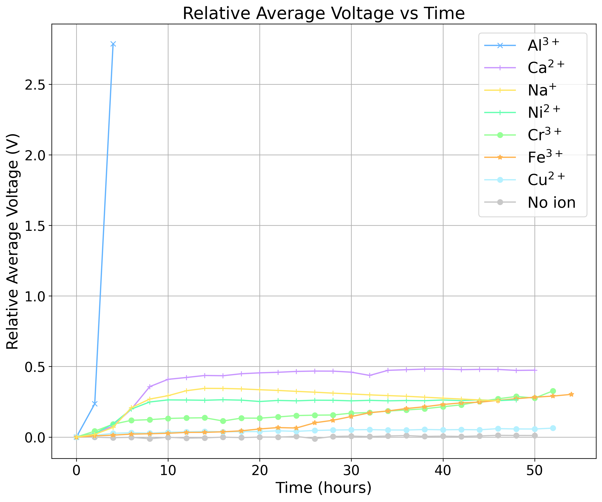

比较 H2SO4 恢复前后的电压：

```bash
python data/scripts/eis_code/v_t_plot_code/v_t_relative_compare_all_renew.py

```
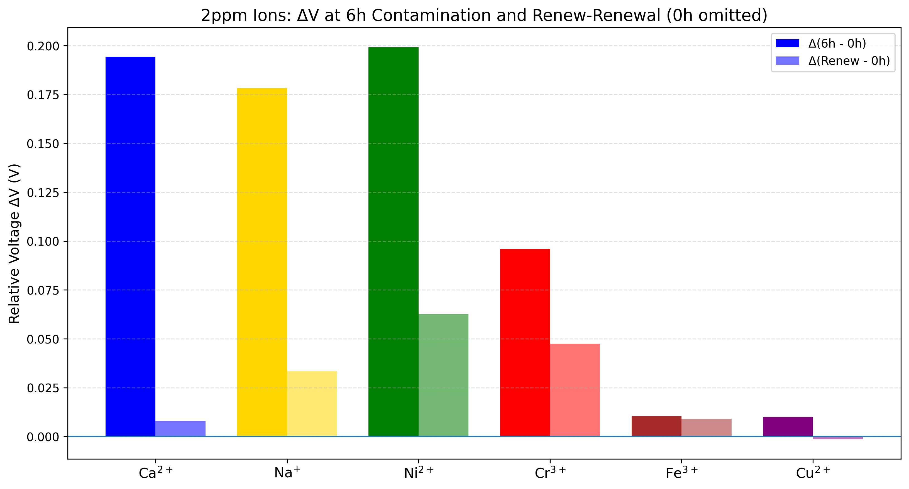

输出图像保存在 `ion_detect/data/volt_t_plot`。

---

### 查看 Nyquist 阻抗随时间的变化

使用 `ion_detect/data/scripts/eis_code/v_t_plot_code/nyquist_plot_zhiyun_and_gamry_xx.py` 作为模板，填写所需的文件夹路径，然后运行：

```bash
python data/scripts/eis_code/nyquist_plot_code/nyquist_plot_zhiyun_and_gamry_plot.py

```
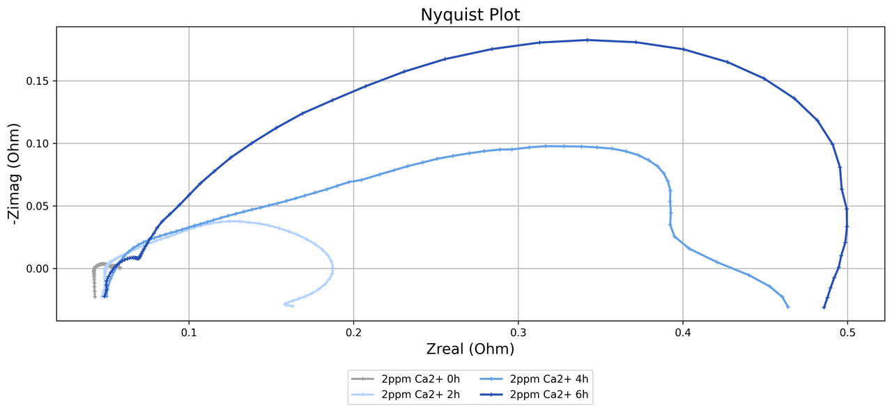

同样，对于 Bode 图：

```bash
python data/scripts/eis_code/nyquist_plot_code/bode_plot_zhiyun_and_gamry_plot.py

```
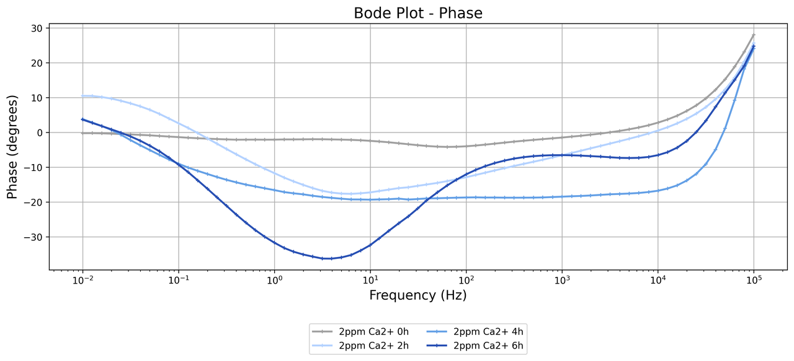  
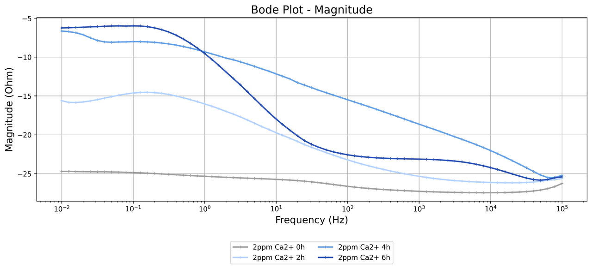

---

### 阻抗拟合

```bash
python data/scripts/all_impedance_fit.py > ../logs/$(date +%Y%m%d).log 2>&1

```

你可以在 `all_impedance_fit.py` 中自定义等效电路和要拟合的数据。

日志保存在 `ion_detect/data/logs`，拟合结果保存在 `/ion_detect/data/eis_fit_results/<date>/`。

### 使用你自己的测试数据进行阻抗拟合

如果你想使用自己的测试数据，请按照相同的结构将其添加到 `校内测试` 文件夹下。

从现有文件夹（如 `data/校内测试/20250103_无离子污染测试/code`）中将 `code` 文件夹（及其脚本）复制到你的新文件夹中。

根据你的数据格式运行 `python run_data_exchange_code_gamry_single.py` 或 `run_data_exchange_code_firecloud_single.py`，然后运行它以生成包含转换数据的 `output_txt`、`output_csv` 和 `output_xlsx` 文件夹。

最后，将你的文件夹路径添加到 `all_impedance_fit.py` 的主程序中进行拟合。

拟合结果将保存在 `ion_detect/data/eis_fit_results/<date>/`。
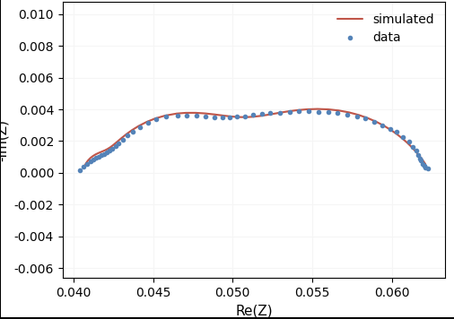

---

### 导出阻抗分析结果

按照 `RO, R1, R2, R3` 的顺序（欧姆阻抗 → 低频 → 中频 → 高频）排序拟合结果：

```bash
python data/scripts/excel_code/excel_PnPw_sequence_all.py  # 修改 folder_path = "20250724" 以匹配你的 eis_fit_results 文件夹名称

```

每个子文件夹将包含 `_sorted.xlsx` 和 `_sorted.png` 文件。
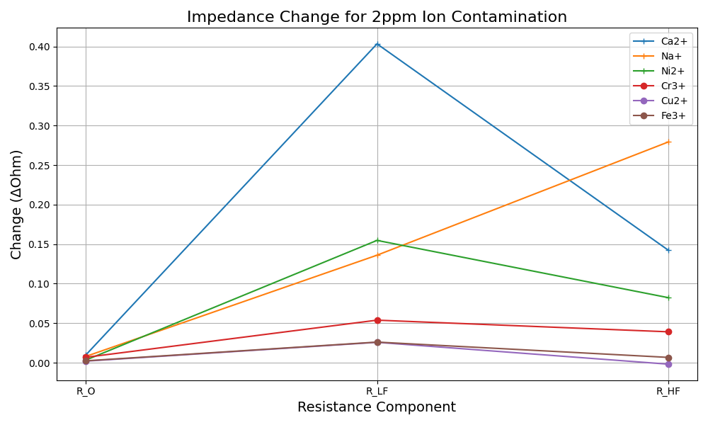  
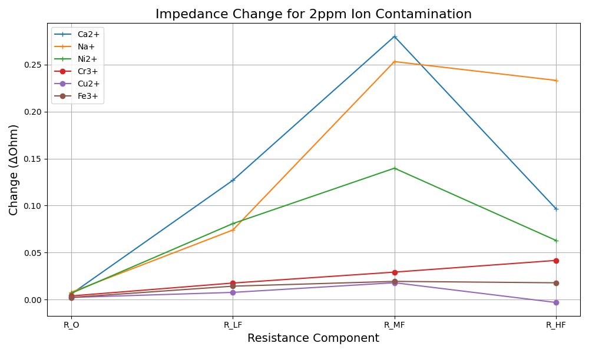

---

### 阻抗拟合结果分析

比较每种离子类型的等效电路参数变化：

```bash
python data/scripts/fit_res_analysis.py  # 修改 date_folder = "20250723" 以匹配你的 eis_fit_results 文件夹名称

```

结果将显示在 `/ion_detect/data/eis_fit_analysis_results` 下，例如 `_20250723.xlsx` 和 `_20250723.png`，展示了每种离子在 0–6 小时内的参数变化。
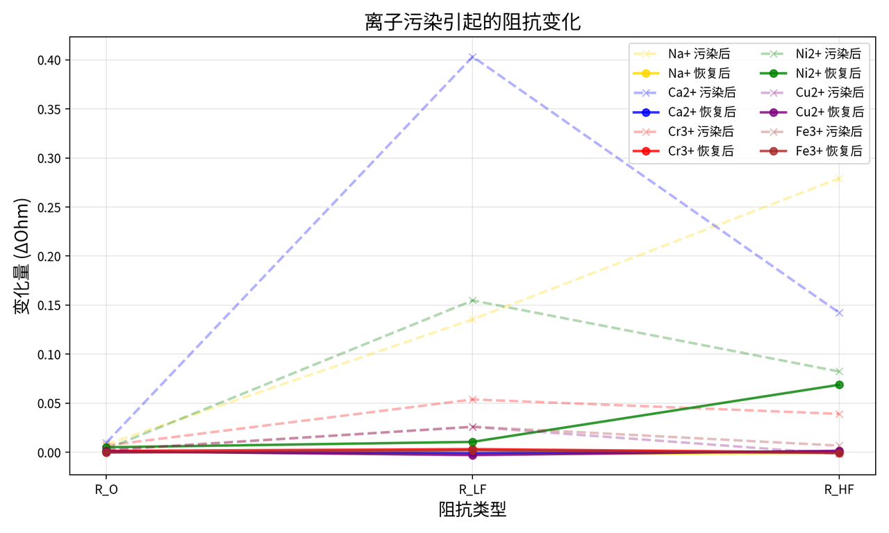  
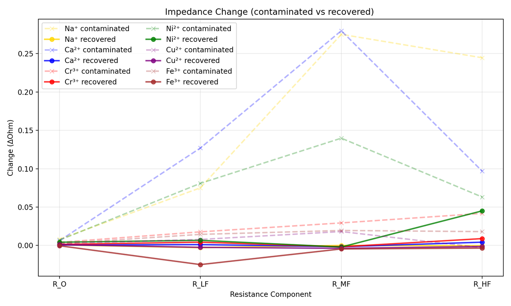

---

### 阻抗拟合结果分析 – H2SO4 恢复对比

```bash
python data/scripts/fit_res_analysis2.py  # 修改 date_folder = "20250723" 以匹配你的 eis_fit_results 文件夹名称

```

结果显示在 `/ion_detect/data/eis_fit_analysis_results` 中，展示了 H2SO4 恢复前、恢复期间和恢复后的参数变化。

---

### 机器学习训练

如果你想使用自己的数据转换为训练数据，请阅读步骤 1 和 2；如果你只是想复现论文，请跳至步骤 3。

1. 在 `ion_detect/data/校内测试/...` 中以相同的文件夹格式组织 `gamry` 或 `firecloud` 数据，然后将你的文件夹路径添加到 `label_machine_learning_excel_export_gamry_range.py` 或 `label_machine_learning_excel_export_firecloud_range.py` 中。
2. 运行以下命令生成格式化的 Excel 文件：
```bash
python data/scripts/excel_code/label_machine_learning_excel_export_gamry_range.py
python data/scripts/excel_code/label_machine_learning_excel_export_firecloud_range.py

```


生成的 Excel 文件将出现在 `/ion_detect/data/校内测试/数据整理_range` 下。
选择所需的训练数据并放入 `ion_detect/datasets/...` 文件夹中进行训练。
命名规范：
* `_ion_` → 离子污染数据
* `_ion_column_` → 离子污染前的数据
* `_ion_column_renew_H2SO4_` → H2SO4 恢复后的数据


你可以在 `/ion_detect/scripts/machine_learning_code/` 下创建自己的训练脚本，例如 `20251213b.yaml`，然后运行训练：
```bash
python scripts/machine_learning_code/main.py --config 20251213b.yaml --train

```


测试：
```bash
python scripts/machine_learning_code/main.py --config 20251213b.yaml --test

```


3. 训练/测试示例命令：
```bash
# 建议在 20251213b.yaml 中设置 `test_folder: "datasets/datasets_for_all_test"`，如果该文件夹名为 datasets_for_all_test，则会自动拆分训练集和测试集（包含所有离子类型）。
python scripts/machine_learning_code/main.py --config 20251213b.yaml --train > ./logs/20251213b.log 2>&1
# 查看 loss 曲线
tensorboard --logdir output/trained_model_save/ --port 6006 --bind_all
# 使用浏览器访问: http://127.0.0.1:6006/

```


模型权重搜索与评估：
```bash
python scripts/machine_learning_code/main.py --config 20251213b.yaml --search > ./logs/20251213b_search.log 2>&1

```


结果保存在 `/ion_detect/output/trained_model_save/20251213b/`。
   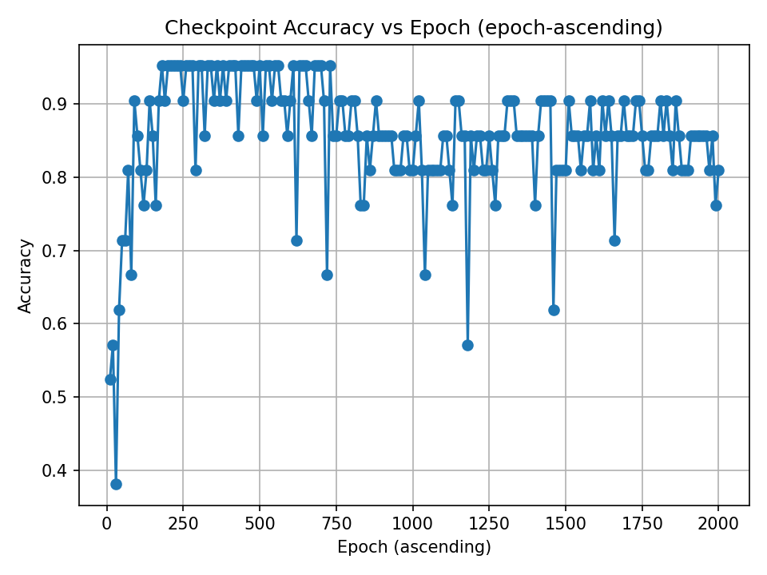

然后你可以将最佳模型命名为 "trained_model_epoch_final.pth"，并使用它执行后续操作：
```bash
# 默认加载 "trained_model_epoch_final.pth" 模型
python scripts/machine_learning_code/main.py --config 20251213b.yaml --test > ./logs/20251213b_test.log 2>&1  

```


结果保存在 `/ion_detect/output/inference_results/20251213b/`。
多进程调试日志存储在 `/ion_detect/scripts/machine_learning_code/debug_logs` 中。

---

### AI 辅助离子效应分析

1. 可视化 0-6h 内不同 2ppm 离子的 `attn_heatmap`、`saliency` 和 `IG`：

```bash
# 设置 config yaml : num_time_points: 4, 然后开始训练模型:
python scripts/machine_learning_code/main.py --config 20251213b.yaml --train
python scripts/machine_learning_code/main.py --config 20251213b.yaml --search
# 搜索最佳模型并命名为: "trained_model_epoch_final.pth" (模型存储在 ion_detect/output/trained_model_save/20251213b/...)
# 移除 "/ion_detect/output/inference_results/20251213b" 中的文件, 设置 20251213b.yaml: `test_folder: "datasets/datasets_for_0_6_2ppm"
python scripts/machine_learning_code/main.py --config 20251213b.yaml --test
python scripts/ml_analysis_code/csv_plot.py --load_run=20251213b

```

这将可视化测试结果。（请确保先运行 `python main.py --config 20251213b.yaml --test`。）

模型会在 `ion_detect/output/inference_results/20251213b/...` 下生成中间预测值和可视化结果，包括 `attn_heatmap`、`saliency` 和 `IG`。

2. 可视化 0-6h 内不同 2ppm 离子的 5 个影响因子的变化：

```bash
# 移除 "/ion_detect/output/inference_results/20251213b" 中的文件, 设置 20251213b.yaml `test_folder: "datasets/datasets_for_0_6_2ppm"
python scripts/machine_learning_code/main.py --config 20251213b.yaml --test
python scripts/ml_analysis_code/csv_plot_param.py --load_run=20251213b

```

这将在 `ion_detect/output/inference_results/20251213b` 下生成离子特定的影响因子可视化。
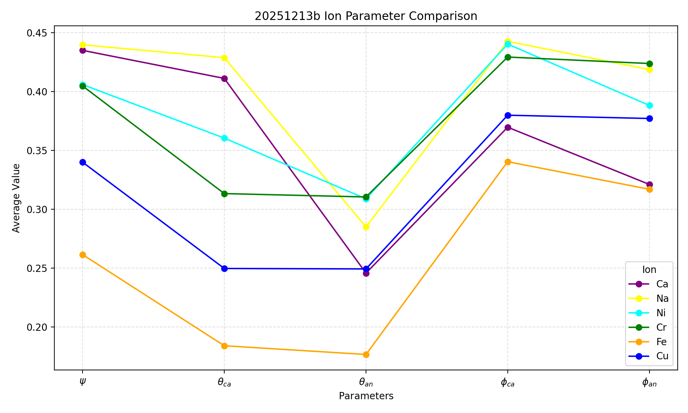

3. 可视化 0–6h 初始状态下 5 个参数的变化（需要涵盖 `[0,2,4,6]` 和 `[6,8,10,12]` 的数据集）：

```bash
# 移除 "/ion_detect/output/inference_results/20251213b" 中的文件, 设置 20251213b.yaml `test_folder: "datasets/datasets_for_range_ion_0_12_2ppm"
python scripts/machine_learning_code/main.py --config 20251213b.yaml --test 
python scripts/ml_analysis_code/csv_plot_param2.py --load_run=20251213b

```

这些图表可以与阻抗拟合的变化情况进行对比。
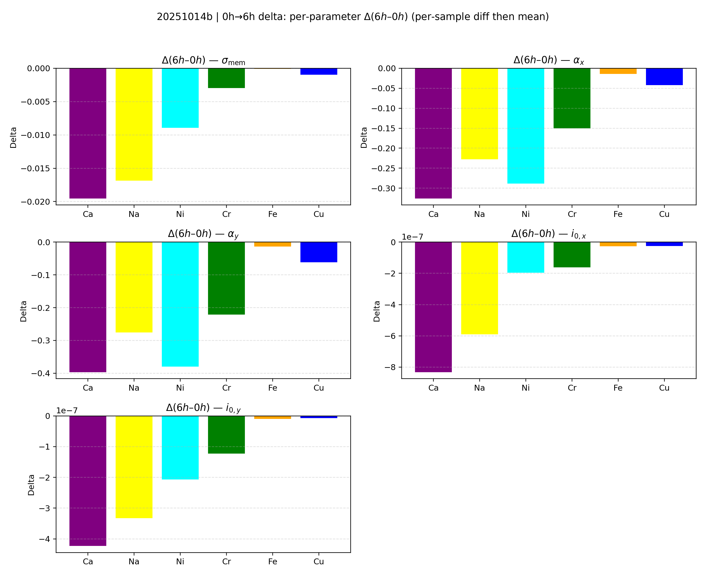

---

### AI 辅助 H2SO4 恢复分析

```bash
# 移除 "/ion_detect/output/inference_results/20251213b" 中的文件, 设置 20251213b.yaml `test_folder: "datasets/datasets_for_all_2ppm"

python main.py --config 20251213b.yaml --test 
python scripts/ml_analysis_code/h2so4_analysis.py --load_run=20251213b

```

这将可视化在污染前（0h）、污染后（6h）和恢复状态下 5 个关键因子的变化。

需要包含 `[0,2,4,6]` 和 `[6,8,10,12]` 的数据集。

这些图表可以与相同三个时间点的阻抗拟合结果进行对比。
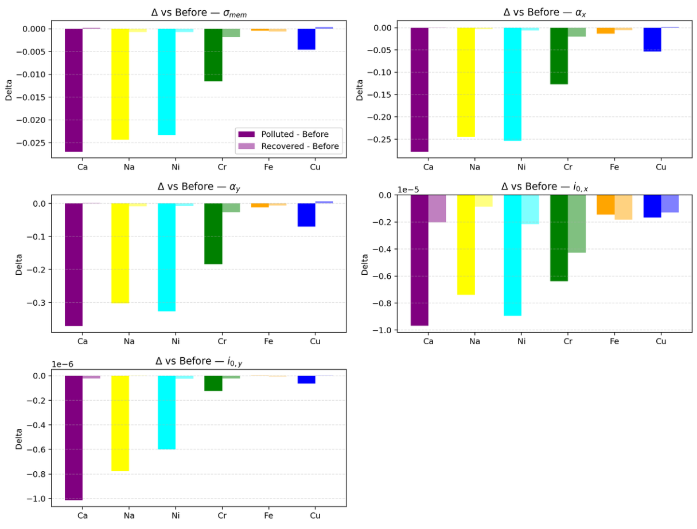

---

